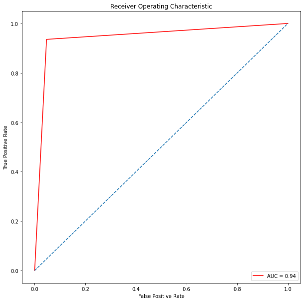

# Mushroom-Classification : régression logistique, SVM, ACP
Ce travail s'inspire du cours [Openclassrooms](https://openclassrooms.com/fr/courses/4444646-entrainez-un-modele-predictif-lineaire/4507851-tp-entrainez-une-regression-logistique-et-une-svm-lineaire) 

## Objectifs
1. Définir le problème
2. Préparer les données
3. Entrainer une régression logistique , une SVM, ACP
4. Améliorer les modèles

## 1. Définir le problème
On cherche à déterminer si un champignon est vénéneux ou sans danger en fonction de ces caracteristiques.
### Dataset 
Le jeu de données comprend des descriptions d'échantillons hypothétiques à 23 espèces de champions.
lien du dataset [kaggle](https://www.kaggle.com/datasets/uciml/mushroom-classification) 

## 2. Préparer les données
- faire une analyse exploratoire et nettoyage des données;
- Séparer le dataset en deux, X (features) et y (label);
- Créer un jeu de données test et train.

## 3. Entrainer une régression logistique , une SVM, ACP
Nous modélisons notre problème de classification avec une regression logistique , une SVM et aller plus loin en réduction de dimension.  
### Régression logistique
L'entraînement du classifieur nous donne une précison de **0.95**

Après la recherche de meilleurs *Hyperparamètres* avec **GridSearchCV** , nous obtenons une précision de **0.96**: le modèle peut faire des prédictions avec **20 %** moins d'erreur.
### SVM
L'entraînement du classifieur nous donne une précision de **0.94**.

### ACP

